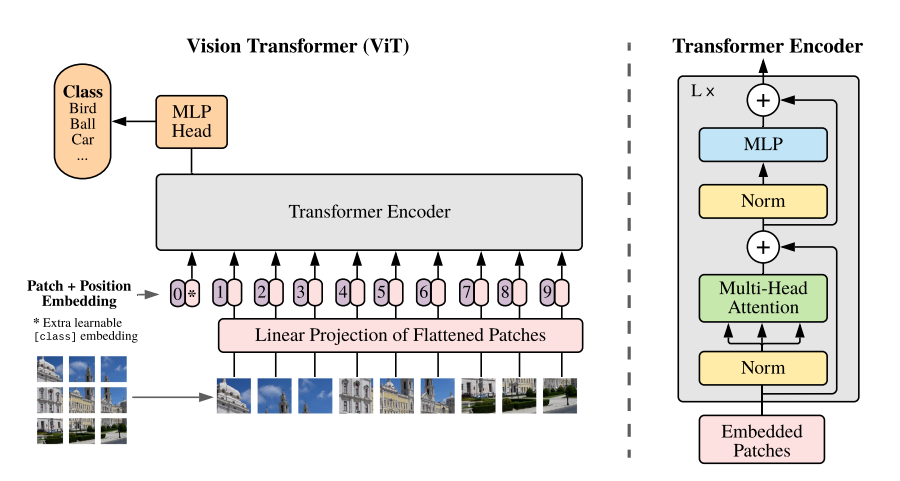
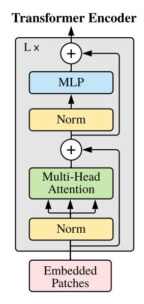
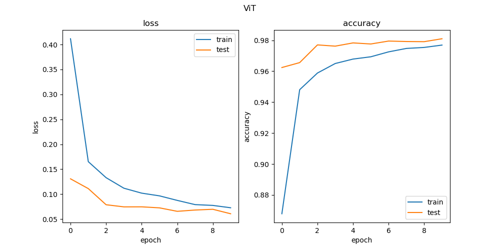

# Vision Transformers
Pytorch implementation of vision transformers



This repository contains a Pytorch implementation of the Vision Transformer model proposed in the paper [An Image is Worth 16x16 Words: Transformers for Image Recognition at Scale](https://arxiv.org/abs/2010.11929). The Vision Transformer model is a transformer model that can be used for image classification tasks. The model is composed of a feature extractor, a positional encoding layer, and a transformer encoder. The feature extractor is a convolutional layer that extracts the features of the image. The positional encoding is a tensor that adds positional information to the input embeddings. The transformer encoder is a stack of transformer blocks that process the input embeddings.

I recommend you if you want to understand the transformer model, to take a look at my [vanilla-transformer](https://github.com/mr-raccoon-97/vanilla-transformer) repository, where I explain the transformer model in detail.


## Feature Extractor

The transformer model, as it is, cannot process images directly. The input to the transformer model is a sequence of embeddings, so a representation of the image in the embedding space must be obtained.

#### Linear Feature Extractor

The original paper uses a linear projection of the image patches to obtain the embeddings. The image is divided into patches, and each patch is flattened to obtain a vector. The vectors are then projected to the embedding space using a linear layer. The linear layer is shared across all patches.

```python
class LinearFeatureExtractor(Module):
    def __init__(self, model_dimension: int, patch_shape: Tuple[int, int], number_of_channels: int):
        super().__init__()
        patch_height, patch_width = patch_shape
        patch_dimension = number_of_channels * patch_height * patch_width
        self.projector = Sequential(
            Rearrange('b c (h ph) (w pw) -> b (h w) (ph pw c)', ph = patch_height, pw = patch_width),
            Linear(patch_dimension, model_dimension),
        )

    def forward(self, image: Tensor) -> Tensor:
        output = self.projector(image)
        return output
```

#### Convolutional Feature Extractor

Another approach to transform an image into an embedding, is to use a convolutional neural network as a feature extractor. The convolutional neural network extracts the features of the image and converts them into a sequence of embeddings.

Let:
- $d\in\mathbb{N}$ the embedding dimension.
- $X\in\mathbb{R}^{c \times h \times w}$ the input image, with $c$ channels, and height and width $h$ and $w$ respectively.

The idea is to divide the input image into blocks of size $k \times k$ or "patches". This can be don with convolutions applied to the image, with $d$ output channels, using filters of size $c \times k \times k$, with a stride of $k$, a filter will be applied to each block of the image. The result will be, given the filter $K\in\mathbb{R}^{c \times k \times k}$:

$$Y = \text{Conv2D}(X, K, \text{out channels}=d,\text{stride}=k)$$

With $Y\in\mathbb{R}^{d \times \frac{h}{k} \times \frac{w}{k}}$. Finally, if the tensor rank is reduced, and it is transposed, a tensor $Y\in\mathbb{R}^{\frac{hw}{k^2} \times d}$ is obtained, which will be the representation of the image in the embedding space.

This can be implemented as follows:

```python
from typing import Tuple
from torch import Tensor, flatten
from torch.nn import Module, Conv2d

class ConvolutionalFeatureExtractor(Module):
    def __init__(self, model_dimension: int, patch_shape: Tuple[int, int], number_of_channels: int):
        super().__init__()
        self.projector = Conv2d(number_of_channels, model_dimension, kernel_size=patch_shape, stride=patch_shape)

    def forward(self, input: Tensor) -> Tensor:
        output = self.projector(input)
        return flatten(output, 2).transpose(1, 2)
```

### CLS Token

The cls token is a token added to the input sequence to help the model perform classification tasks. The cls token is added to the input sequence at the beginning of the sequence. The cls token is a learnable parameter that is updated during training.

```python
class CLSToken(Module):
    def __init__(self, model_dimension: int):
        super().__init__()
        self.token = Parameter(randn(1, 1, model_dimension))

    def forward(self, input: Tensor) -> Tensor:
        batch_size = input.shape[0]
        token = self.token.expand(batch_size, -1, -1)
        return cat([token, input], dim=1)
```

### Positional Encoding

```python	
class LearnablePositionalEncoding(Module):
    def __init__(self, model_dimension: int, sequence_lenght_limit: int = 196):
        super().__init__()
        self.sequence_lenght_limit = sequence_lenght_limit
        self.position_embeddings = Parameter(randn(1, sequence_lenght_limit + 1, model_dimension))

    def forward(self, input: Tensor) -> Tensor:
        assert input.size(1) <= self.sequence_lenght_limit + 1, 'input sequence is too long'
        input = input + self.position_embeddings[:, :input.size(1)]
        return input
```


### The Transformer

The vision transformer as described in the paper is an encoder-only transformer. Each encoder is composed of a multi-head self-attention layer and a feedforward neural network. 



The paper uses a GELU activation function and LayerNorm normalization. The multi-head self-attention layer is followed by a feedforward neural network. The output of the feedforward neural network is added to the output of the multi-head self-attention layer. The output of the feedforward neural network is then passed through a LayerNorm normalization layer.

```python
class Encoder(Module):
    def __init__(self, model_dimension: int, hidden_dimension: int, number_of_heads: int, dropout: float = 0.):
        super().__init__()
        self.normalization = LayerNorm(model_dimension)
        self.attention = MultiheadAttention(model_dimension, number_of_heads, dropout = dropout, batch_first=True)
        self.feed_forward = Sequential(
            LayerNorm(model_dimension),
            Linear(model_dimension, hidden_dimension),
            GELU(),
            Dropout(dropout),
            Linear(hidden_dimension, model_dimension),
            Dropout(dropout)
        )
        
    def forward(self, input: Tensor, need_weights: bool = False) -> Tuple[Tensor, Optional[Tensor]]:
        output = self.normalization(input)
        output, weights = self.attention(output, output, output, need_weights=need_weights)
        output = output + input
        output = self.feed_forward(output) + output
        return output, weights
```

The weights of the multi-head self-attention layer can be returned if the `need_weights` parameter is set to `True`, This is for visualization purposes, and to understand how the model is attending to the input sequence. It's recommended to set this parameter to `False` during training, so PyTorch can use the optimized implementation of scaled dot-product attention.

```python
class Transformer(Module):
    def __init__(self, model_dimension: int, hidden_dimension: int, number_of_layers: int, number_of_heads: int, dropout = 0.):
        super().__init__()
        self.norm = LayerNorm(model_dimension)
        self.layers = ModuleList([
            Encoder(model_dimension, hidden_dimension, number_of_heads, dropout) for layer in range(number_of_layers)
        ])

    def forward(self, sequence: Tensor, need_weights: bool = False) -> Tuple[Tensor, List[Optional[Tensor]]]:
        attention_weights = []
        for layer in self.layers:
            sequence, weights = layer(sequence)
            attention_weights.append(weights)
        return self.norm(sequence), attention_weights 
```

Then, the Vision Transformer model is composed of the feature extractor, the cls token, the positional encoding, and the transformer encoder, and can be simply expressed as a sequence of the modules described above, with a classification head at the end.

```python
class ViT(Module):
    def __init__(
        self, 
        patch_shape: Tuple[int, int], 
        model_dimension: int, 
        number_of_layers: int, 
        number_of_heads: int, 
        hidden_dimension: int, 
        number_of_channels: int, 
        number_of_classes: int,
        max_image_shape: Tuple[int, int] = (28, 28),
        dropout = 0., 
    ):
        super().__init__()
        self.image_to_embeddings = Sequential(
            ConvolutionalImagePatchEmbedding(model_dimension, patch_shape, number_of_channels),
            CLSToken(model_dimension),
            LearnablePositionalEncoding(model_dimension, number_of_patches(max_image_shape, patch_shape)),
            Dropout(dropout),
        )

        self.transformer = Transformer(model_dimension, hidden_dimension, number_of_layers, number_of_heads, dropout)
        self.head = ClassificationHead(model_dimension, number_of_classes)

    def forward(self, image: Tensor) -> Tensor:
        output = self.image_to_embeddings(image)
        output, weights = self.transformer(output)
        return self.head(output)
```

### Some training results

You can see it in action in the [notebook](notebook.ipynb), for a very simple experiment with the MNIST dataset. Just to see how it works. In the future, I will be training it on a more complex dataset for some specific task.



You can see the training logs in tensorboard by running:

```bash
git clone https://github.com/mr-raccoon-97/vision-transformers.git
cd vision-transformers
tensorboard --logdir=logs
```

Then, open your browser and go to `http://localhost:6006/` to see the training logs.